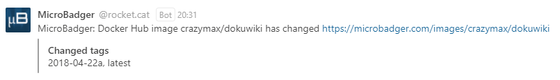

## About

Add [MicroBadger](https://microbadger.com) Docker image changes notifications via a new WebHook in Rocket.Chat.

## Receive alerts

* Create a new **Incoming WebHook** in Administration > Integrations
* Select the channel where you will receive the alerts. You may wish to create a dedicated channel for your notifications.
* Select an account from which the alerts will be posted. You may wish to create a dedicated account just for notifications.
* Set the "Enable Scripts" option to `True`.
* Copy content of [microbadger-incoming.js](src/microbadger-incoming.js) in Script field.
* Save the integration. This will generate a webhook URL and secret for you.
* Go to [MicroBadger -> Notifications](https://microbadger.com/notifications)
* **Create a notification** with a Docker image of your choice and set the Webhook URL generated.

## How can I help ?

All kinds of contributions are welcome :raised_hands:! 
The most basic way to show your support is to star :star2: the project, or to raise issues :speech_balloon: 
But we're not gonna lie to each other, I'd rather you buy me a beer or two :beers:!

 

## License

MIT. See `LICENSE` for more details.
